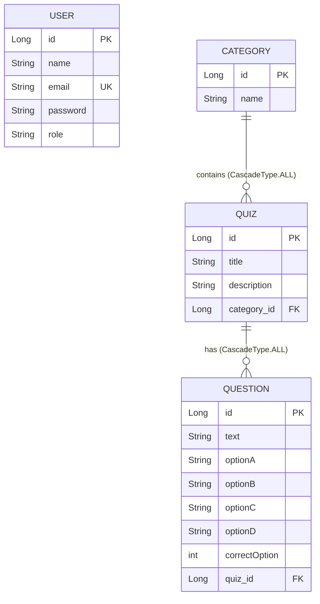

# Technical Interview Preparation Guide: Spring Boot Quiz Application

This guide serves as your comprehensive handbook to confidently pitch, explain, and defend the architectural and implementation decisions behind your **Quiz Application** in technical interviews. It translates your codebase into high-impact talking points that will impress interviewers, covering core MVC patterns, ORM relationships, security vulnerabilities (and solutions), transaction boundaries, and scalability considerations.

---

## 1. The "Elevator Pitch" (Using the STAR Method)

When an interviewer says: **"Tell me about your project,"** do not just list the technologies. Use the **STAR** (Situation, Task, Action, Result) method to tell a compelling story.

### The Pitch
* **Situation:** "During my 5th semester, I wanted to build a robust, scalable system that solves a classic web problem: dynamic assessment and management of educational quizzes. Traditional quiz platforms often struggle with monolithic data dependencies and sub-optimal content management."
* **Task:** "I set out to build **QuizApplication**, a fully featured Spring Boot monolith that supports two completely distinct user flows: a Student Flow for taking quizzes and viewing instant dynamic grading, and a highly granular Admin Dashboard for managing categories, quizzes, questions, and users."
* **Action:** "I engineered the backend using **Spring Boot 3.x** and **Java 17**, utilizing **Spring Data JPA** with **Hibernate ORM** to connect to a **MySQL** database. I structured the data layer with strict cascading associations (`One-to-Many` and `Many-to-One`) to support safe delete operations, encapsulated business logic within transaction-bounded service layers using `@Transactional`, and designed a dynamic grade-scoring engine on the backend. For the frontend, I used **Thymeleaf** for server-side template rendering, combined with a curated custom styling system."
* **Result:** "The result is a production-ready, transactional system that ensures perfect data integrity. The application easily handles dynamic user inputs, guarantees clean deletion cycles through cascaded relationships, and utilizes secure validation regex to filter accounts, laying a perfect foundation for scaling into a cloud-native microservices architecture."

---

## 2. System Architecture & Component Mapping

Your application is structured as a **classical Monolithic MVC Architecture** which enforces clean separation of concerns:

```
                  ┌──────────────────────────────┐
                  │      Client Browser          │
                  └──────────────┬───────────────┘
                                 │ HTTP Requests (GET / POST)
                                 ▼
                  ┌──────────────────────────────┐
                  │    Thymeleaf Templates       │ (Views - HTML & CSS)
                  └──────────────▲───────────────┘
                                 │ Models / Redirects
                                 ▼
                  ┌──────────────────────────────┐
                  │    Spring MVC Controllers    │ (Presentation Layer)
                  └──────────────┬───────────────┘
                                 │ Injects Services
                                 ▼
                  ┌──────────────────────────────┐
                  │      Service Layer           │ (Business Logic & Transactions)
                  └──────────────┬───────────────┘
                                 │ Injects JpaRepositories
                                 ▼
                  ┌──────────────────────────────┐
                  │     Spring Data JPA          │ (Data Access Layer - Hibernate)
                  └──────────────┬───────────────┘
                                 │ SQL Commands
                                 ▼
                  ┌──────────────────────────────┐
                  │       MySQL Database         │ (Persistence Layer)
                  └──────────────────────────────┘
```

### Files & Component Breakdown

Here is a map of the key files in your workspace, how they interact, and their exact responsibilities:

| Component / Layer | Key File Link | Primary Responsibility | Key Technical Highlight |
| :--- | :--- | :--- | :--- |
| **Model (Entities)** | [User.java](file:///D:/sem%205/APC/QuizApplication/src/main/java/com/Project/QuizApplication/models/User.java) | Maps the system user data and holds role flags (`"USER"` vs `"ADMIN"`). | Unique column constraint on email field. |
| **Model (Entities)** | [Category.java](file:///D:/sem%205/APC/QuizApplication/src/main/java/com/Project/QuizApplication/models/Category.java) | Groups quizzes by educational subjects (e.g. Java, DBMS, Operating Systems). | Houses a `@OneToMany(mappedBy = "category", cascade = CascadeType.ALL)` relationship with `Quiz`. |
| **Model (Entities)** | [Quiz.java](file:///D:/sem%205/APC/QuizApplication/src/main/java/com/Project/QuizApplication/models/Quiz.java) | Represents a specific quiz sheet, housing a title, description, and list of questions. | Connects to `Category` via `@ManyToOne` and `Question` via `@OneToMany(cascade = CascadeType.ALL)`. |
| **Model (Entities)** | [Question.java](file:///D:/sem%205/APC/QuizApplication/src/main/java/com/Project/QuizApplication/models/Question.java) | Stores individual quiz questions, 4 options (A-D), and the correct option index (1-4). | Includes a helper method `getAnswer()` using Java's modern `switch` expression pattern. |
| **Data Access** | [UserRepository.java](file:///D:/sem%205/APC/QuizApplication/src/main/java/com/Project/QuizApplication/repositories/UserRepository.java) | Abstracts MySQL queries for the `User` entity. | Defines `findByEmailAndPassword` which Hibernate auto-compiles into SQL. |
| **Data Access** | [QuestionRepository.java](file:///D:/sem%205/APC/QuizApplication/src/main/java/com/Project/QuizApplication/repositories/QuestionRepository.java) | Abstracts queries for the `Question` entity. | Demonstrates custom JPQL query usage via `@Query("SELECT q FROM Question q")`. |
| **Service (Logic)** | [AuthService.java](file:///D:/sem%205/APC/QuizApplication/src/main/java/com/Project/QuizApplication/services/AuthService.java) | Enforces custom password complexity regex patterns and performs authentication checking. | Houses the transactional logic for register operations. |
| **Service (Logic)** | [AdminService.java](file:///D:/sem%205/APC/QuizApplication/src/main/java/com/Project/QuizApplication/services/AdminService.java) | Performs transactional CRUD modifications on users, categories, quizzes, and questions. | Extensively utilizes `@Transactional` to avoid partial failures during parent deletions. |
| **Controller** | [AuthController.java](file:///D:/sem%205/APC/QuizApplication/src/main/java/com/Project/QuizApplication/controllers/AuthController.java) | Handles basic security entry points: routes traffic to dashboards based on roles. | Integrates `@ModelAttribute` bindings and redirects. |
| **Controller** | [AdminController.java](file:///D:/sem%205/APC/QuizApplication/src/main/java/com/Project/QuizApplication/controllers/AdminController.java) | Serves the admin panel, populating statistical details and processing structural updates. | Uses `@RequestParam` for simple inputs and handles redirection attributes. |
| **Controller** | [UserController.java](file:///D:/sem%205/APC/QuizApplication/src/main/java/com/Project/QuizApplication/controllers/UserController.java) | Handles student activities including displaying eligible quizzes and grading attempts. | Dynamically parses nested HTTP parameters into a Map object for server-side evaluation. |

---

## 3. Database Schema & ORM Relationships

An interviewer will look closely at how you modeled your data using **Hibernate ORM**. Your database contains a hierarchical, highly normalized relational structure:

### Entity Relationship Diagram (ERD)



### Explaining the Cascades & Transactions to an Interviewer

> **Interviewer:** *"I see you configured `@OneToMany(mappedBy = "category", cascade = CascadeType.ALL)` on the Category model, and similar configurations for Quizzes. Why?"*
>
> **Your Answer:** 
> "By specifying `CascadeType.ALL`, I set up **parent-child lifecycle propagation**. In this domain, a Quiz cannot exist without a Category, and a Question cannot exist without a Quiz. 
> 
> If a category (e.g. 'Java') is deleted, Hibernate automatically issues delete queries for all associated quizzes, which in turn cascades down to delete every associated question. This prevents **orphaned rows** in the database and preserves referential integrity.
>
> To support this safely, I decorated the deletion methods in [AdminService.java](file:///D:/sem%205/APC/QuizApplication/src/main/java/com/Project/QuizApplication/services/AdminService.java) (like `deleteCategory` and `deleteQuiz`) with `@Transactional`. This ensures that all cascaded deletes are executed inside a **single transaction boundary**. If any query fails (e.g. due to database locks), the entire transaction rolls back, preventing an inconsistent database state."

---

## 4. Key Code Highlights & Technical Deep Dive

To show true engineering depth, you must be ready to highlight specific blocks of code and explain *why* they were designed that way.

### Highlight A: Dynamic Form Grading Mechanic
* **Location:** [UserController.java](file:///D:/sem%205/APC/QuizApplication/src/main/java/com/Project/QuizApplication/controllers/UserController.java#L42-L73)

```java
@PostMapping("/quiz/{id}/submit")
public String submitQuiz(@PathVariable Long id,
                         @RequestParam Map<String, String> answers,
                         Model model) {
    Quiz quiz = quizRepository.findById(id).orElseThrow(...);
    List<Question> questions = questionRepository.findByQuizId(id);
    int score = 0;

    for (int i = 0; i < questions.size(); i++) {
        Question question = questions.get(i);
        String submittedAnswerStr = answers.get("answers[" + i + "]");
        
        if (submittedAnswerStr != null) {
            try {
                int submittedAnswer = Integer.parseInt(submittedAnswerStr);
                if (question.getCorrectOption() == submittedAnswer) {
                    score++;
                }
            } catch (NumberFormatException e) { ... }
        }
    }
    // ...
}
```

#### Why this is impressive to an interviewer:
"Instead of hardcoding a form submission to bind to a fixed object, I designed a **dynamic, client-agnostic grading engine**. The controller accepts all form inputs as a generic HTTP query map `Map<String, String> answers`.
This map stores submitted options in the format `answers[index] = optionCode`. On the server side, I fetch the ground-truth questions from the database, iterate through them, safely parse the values, and evaluate them against `correctOption`. 

**This pattern is bulletproof:**
1. **Dynamic Scaling:** It supports quizzes with 5 questions or 500 questions seamlessly without code changes.
2. **Cheat Prevention:** The evaluation is entirely server-side. The client's browser never receives correct options beforehand (unlike client-side JS grading systems which are easily hacked by viewing source code)."

---

### Highlight B: Custom Password Regex Complexity Engine
* **Location:** [AuthService.java](file:///D:/sem%205/APC/QuizApplication/src/main/java/com/Project/QuizApplication/services/AuthService.java#L17-L34)

```java
private static final String PASSWORD_PATTERN =
        "^(?=.*[A-Z])(?=.*[!@#$%^&*()_+\\-\\[\\]{};':\"\\\\|,.<>/?]).{8,}$";
private static final Pattern pattern = Pattern.compile(PASSWORD_PATTERN);

public boolean isValidPassword(String password) {
    return password != null && pattern.matcher(password).matches();
}
```

#### Why this is impressive to an interviewer:
"Rather than relying blindly on third-party security frameworks for simple validations, I implemented a compiled, thread-safe static `Pattern` matching engine. The regex utilizes **lookahead assertions** (`(?=.*[A-Z])` and `(?=.*[special_character])`) to enforce security policies:
1. At least one uppercase English letter.
2. At least one special symbol from a comprehensive character class.
3. A minimum length constraint of 8 characters.

By caching the compiled `Pattern` as a private static final field, I avoid compiling the regex pattern on every registration request, which saves heap allocations and mitigates CPU cycles under high-concurrency registration spikes."

---

## 5. Curated Technical Interview Q&A (Categorized)

Expect interviewers to push the boundaries of your knowledge. Study these questions and answers to show complete command of your system.

### Category 1: Spring MVC & Web Internals

#### Q1.1: What is the request flow in your Spring Boot application when a user attempts a quiz?
> **Answer:** 
> 1. The client sends an HTTP GET request to `/user/quiz/{id}`.
> 2. The front controller, **`DispatcherServlet`**, intercepts the request and queries the handler mappings.
> 3. It forwards the request to the `attemptQuiz` method inside [UserController.java](file:///D:/sem%205/APC/QuizApplication/src/main/java/com/Project/QuizApplication/controllers/UserController.java).
> 4. The controller uses dependency-injected [QuizRepository](file:///D:/sem%205/APC/QuizApplication/src/main/java/com/Project/QuizApplication/repositories/QuizRepository.java) and [QuestionRepository](file:///D:/sem%205/APC/QuizApplication/src/main/java/com/Project/QuizApplication/repositories/QuestionRepository.java) to retrieve entities from the MySQL database.
> 5. These entities are attached to the `Model` object as variables.
> 6. The controller returns a logical string identifier: `"attempt-quiz"`.
> 7. The **`ViewResolver`** matches this string to `src/main/resources/templates/attempt-quiz.html`.
> 8. **Thymeleaf** parses the HTML template server-side, compiles the dynamic variables into a static HTML file, and the servlet returns it to the client with an HTTP 200 status code.

#### Q1.2: How does Dependency Injection work in your code?
> **Answer:** 
> "I use field-level injection using Spring's `@Autowired` annotation to inject repository interfaces and services (e.g., in [AdminController.java](file:///D:/sem%205/APC/QuizApplication/src/main/java/com/Project/QuizApplication/controllers/AdminController.java)). At application startup, the **Spring ApplicationContext** scans my packages, identifies classes annotated with `@Component`, `@Service`, `@Repository`, or `@Controller`, registers them as Singleton beans, manages their lifecycle, and injects them where needed."
> 
> **Follow-up / Pro-Tip:** If asked, acknowledge that **Constructor Injection** is generally preferred over Field Injection (`@Autowired` on variables) because it makes testing easier (you can easily mock dependencies without using reflection frameworks) and enforces immutability (`final` dependencies).

---

### Category 2: JPA, Hibernate & Transaction Management

#### Q2.1: What is the difference between `@ManyToOne` and `@OneToMany` in terms of performance and default fetch types?
> **Answer:** 
> "By default, `@ManyToOne` associations (like `Category` in `Quiz`) are fetched **EAGERLY** in JPA, meaning the parent record is loaded immediately via a SQL join or supplementary query. 
> 
> Conversely, `@OneToMany` associations (like `questions` in `Quiz`) are fetched **LAZILY** by default. They are only loaded from the database when the `getQuestions()` getter is invoked. 
> 
> In a production system, eager loading can lead to massive performance degradation if not monitored. I keep collections lazy to save memory and database bandwidth."

#### Q2.2: How would you solve the Hibernate "N+1 Selects" problem in your project?
> **Answer:** 
> "The N+1 problem occurs when fetching a list of parent entities (e.g., 50 quizzes) and then looping through them to fetch their children (questions), resulting in 1 initial query to get the parents, and then N additional queries for the children.
> 
> To solve this, I would override the query in the repository using **Entity Graphs** or a JPQL query with a **`JOIN FETCH`** clause. For example:
> ```java
> @Query("SELECT q FROM Quiz q LEFT JOIN FETCH q.questions")
> List<Quiz> findAllQuizzesWithQuestions();
> ```
> This forces Hibernate to load both parent and children in a **single SQL JOIN query**, slashing database roundtrips from 51 down to 1."

#### Q2.3: What is `@Transactional` and what happens when an exception occurs inside a transaction?
> **Answer:** 
> "`@Transactional` marks a service method as an atomic block of execution. When a method starts, Spring starts a database transaction. If the method completes successfully, it commits the transaction.
> 
> If a `RuntimeException` or an `Error` is thrown, Spring automatically triggers a database **rollback**. If a checked exception occurs (e.g. `IOException`), it does *not* roll back by default unless explicitly configured with `@Transactional(rollbackFor = Exception.class)`. In my [AdminService](file:///D:/sem%205/APC/QuizApplication/src/main/java/com/Project/QuizApplication/services/AdminService.java), methods throwing `RuntimeException` on missing data will trigger rollbacks, keeping the data consistent."

---

### Category 3: Security & Code Hardening (CRITICAL)

Interviewers *love* pointing out security vulnerabilities. Being proactive and calling them out *before* they do will show immense maturity.

> [!WARNING]
> Your current implementation stores passwords in **plain-text** and maps URLs directly without authorization tokens. Prepare to address this directly!

#### Q3.1: I noticed that passwords are saved in plain-text inside `AuthService.registerUser()`. Why, and how would you secure this in a production system?
> **Answer:** 
> "Yes, in the current academic implementation, passwords are saved in plain text in the database to simplify setup and debugging without introducing heavy dependencies. 
> 
> **However, this is a major security vulnerability for production.**
> To secure it, I would integrate **Spring Security** and implement the **`BCryptPasswordEncoder`**.
>
> 1. During registration, I would pass the password through `bcrypt.encode(rawPassword)`. BCrypt automatically generates a secure, random **Salt** and performs adaptive hashing (stretching the work factor) before storing the hash in the DB.
> 2. During login, instead of using SQL query comparisons like `findByEmailAndPassword`, I would load the user by email, and use `passwordEncoder.matches(rawPassword, dbHash)` to verify the credentials. This protects against database leaks, as attackers cannot recover original passwords from BCrypt hashes."

#### Q3.2: How does your application protect against SQL Injection?
> **Answer:** 
> "My application uses **Spring Data JPA** which internally leverages Hibernate's **PreparedStatements** and named parameter bindings. Because Hibernate maps arguments dynamically using query placeholders rather than concatenating raw inputs into SQL strings (e.g., `findByEmailAndPassword(String email, String password)` compiled into a prepared query), input parameters are always sanitized, completely rendering SQL injection attacks ineffective."

#### Q3.3: Since you are not using Spring Security, is your application vulnerable to Session Hijacking or CSRF?
> **Answer:** 
> "Yes. Without a secure session management layer (like Spring Security's CSRF tokens), the application is vulnerable. Standard HTML forms could be exploited by third-party malicious sites to perform Cross-Site Request Forgery (CSRF) on behalf of a logged-in admin.
> 
> To mitigate this, I would add **Spring Security** to generate and validate CSRF tokens on all POST requests, and mark HTTP session cookies with `HttpOnly` and `SameSite=Strict` flags to block cross-origin script reads."

---

### Category 4: Performance & Scaling

#### Q4.1: If 100,000 students attempt a quiz simultaneously, where will your application bottleneck, and how would you scale it?
> **Answer:** 
> "The bottlenecks would hit two primary areas:
> 1. **Database Connections:** MySQL would run out of available connection pool slots (configured via HikariCP).
> 2. **CPU and I/O:** Compiling Thymeleaf templates on the server-side for 100k users would exhaust CPU cores.
> 
> **How I would scale the system:**
> * **Database Caching:** I would introduce **Redis** as a caching layer. Quiz questions and structures are read-heavy and rarely change during an active quiz event. Storing the quiz payload in Redis cache bypasses MySQL entirely for question fetches.
> * **Decoupled Architecture (Rest API + SPA):** Instead of using server-side Thymeleaf rendering, I would convert the backend into a pure **Spring Boot REST API** returning lightweight JSON. I would build a decoupled frontend using a Single Page Application framework (like **React** or **Vue**). This offloads all rendering work to the client’s browser, scaling the server's throughput exponentially.
> * **Load Balancing & Horizontal Scaling:** I would containerize the Spring Boot application using **Docker**, deploy it on **Kubernetes**, and scale the API pods horizontally behind an **NGINX** or AWS ALB load balancer."

---

## 6. Proactive Project Enhancements (Roadmap)

To stand out from other candidates, present this slide-deck of future enhancements you have researched and are ready to execute:

1. **Spring Security + JWT Integration:**
   * Transition the stateful HttpSession system into stateless **JSON Web Tokens (JWT)**. This allows the backend to be fully stateless, laying the groundwork for microservice distribution.
2. **REST API Migration:**
   * Expose REST endpoints (`@RestController`) replacing Thymeleaf controllers, mapping JSON payloads to secure DTOs (Data Transfer Objects) to separate db entities from API contracts.
3. **Advanced Anti-Cheat Mechanics:**
   * Inject client-side JavaScript that tracks page visibility changes (window switching).
   - If a student blurs the browser window to search for an answer, the JS alerts the server, which can automatically mark, lock, or deduct points from the active quiz session.
4. **WebSocket Real-time Leaderboards:**
   * Build a STOMP over WebSocket channel to broadcast student scores live as they submit, creating an interactive, real-time classroom dashboard.
